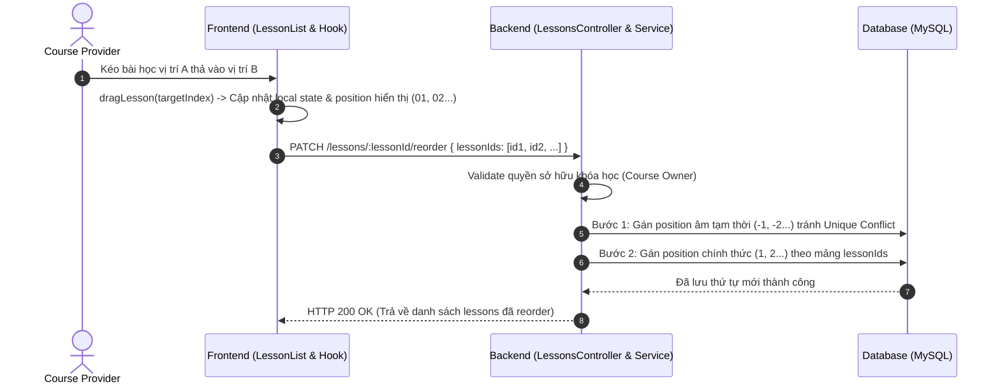

# Tài Liệu Kỹ Thuật: Thay Đổi Quản Lý Vị Trí & Reorder Bài Học (Lesson Positioning & Drag and Drop)

Tài liệu này tổng hợp chi tiết các cập nhật về mặt **Backend** và **Frontend** liên quan đến việc quản lý vị trí (`position`) cũng như tính năng sắp xếp lại bài học (**Lesson Reordering / Drag & Drop**) trong cùng một khóa học (`Course`).

---

## 1. Giới Thệu Tổng Quan

- **Mục tiêu**: Cho phép người dùng (Course Provider) dễ dàng tùy chỉnh thứ tự các bài học trong một khóa học thông qua thao tác kéo thả (Drag and Drop) trên giao diện, đồng thời đảm bảo tính toàn vẹn dữ liệu vị trí (`position`) ở phía cơ sở dữ liệu.
- **Phạm vi thay đổi**:
  - **Backend**: Thêm logic tự động gán position khi tạo mới, unique constraint `(courseId, position)`, endpoint reorder và giải thuật 2 bước xử lý xung đột index khi update.
  - **Frontend**: Hiển thị số thứ tự định dạng 2 chữ số (`01`, `02`, ...), tích hợp HTML5 Drag and Drop và đồng bộ API reorder lập tức sau khi kéo thả.

---

## 2. Thay Đổi Phía Backend

### 2.1. Cơ Sở Dữ Liệu & Entity
- **Entity**: `Lesson` (`backend/monolithic/src/modules/lessons/entities/lesson.entity.ts`)
- **Trường `position`**: Kiểu dữ liệu `number`, đại diện cho thứ tự của bài học trong khóa học.
- **Ràng buộc duy nhất (Unique Constraint)**: Đảm bảo trong cùng 1 khóa học (`course_id`), không có 2 bài học nào có trùng giá trị `position`.

---

### 2.2. Tự Động Gán Vị Trí Khi Tạo Mới (`create`)
*File*: `backend/monolithic/src/modules/lessons/service/lessons.service.ts`

Khi một bài học mới được thêm vào khóa học:
1. Backend lấy vị trí lớn nhất hiện tại (`maxPosition`) của các bài học thuộc khóa học đó thông qua `lessonsRepo.getMaxPosition(courseId)`.
2. Gán vị trí cho bài học mới:
   $$\text{position} = (\text{maxPosition} \text{ ?? } 0) + 1$$

---

### 2.3. Endpoint Reorder Vị Trí Bài Học (`PATCH /lessons/:lessonId/reorder`)

#### A. Controller Specification
- **Path**: `PATCH /lessons/:lessonId/reorder`
- **Guards / Permissions**: `@UseGuards(JwtAuthGuard, RolesGuard)`, yêu cầu vai trò `COURSE_PROVIDER`.
- **Param**: `lessonId` (ID của một bài học đại diện thuộc khóa học cần reorder).
- **Body (`ReorderLessonsDto`)**:
  ```typescript
  export class ReorderLessonsDto {
    @IsArray()
    @IsNumber({}, { each: true })
    lessonIds: number[]; // Mảng danh sách các lessonId theo thứ tự mới từ trên xuống dưới
  }
  ```

#### B. Thuật Toán Tránh Lỗi Unique Constraint (2-Step Reorder Logic)
*File*: `lessons.service.ts` -> method `reorderLessons`

##### Vấn đề:
Khi cập nhật hàng loạt vị trí của các record có unique constraint `(course_id, position)` trong MySQL, việc update tuần tự từng dòng dễ dẫn đến lỗi `Duplicate entry 'course_id-position'` (ví dụ: đổi vị trí bài 1 thành 2 khi bài 2 vẫn đang giữ position = 2 trong DB).

##### Giải pháp (2 bước):
1. **Bước 1 (Gán vị trí âm tạm thời)**:
   Gán tạm các giá trị `position` âm (`-1`, `-2`, `-3`, ...) cho tất cả các bài học cần sắp xếp và lưu tạm vào DB. Điều này giúp giải phóng các vị trí dương hiện tại mà không làm vi phạm Unique Constraint.
   ```typescript
   await this.lessonsRepo.saveMany(
     validLessons.map((l, i) => ({ ...l, position: -(i + 1) } as Lesson))
   );
   ```
2. **Bước 2 (Gán vị trí chuẩn mới)**:
   Duyệt qua danh sách mảng `lessonIds` theo thứ tự mới truyền từ client lên, gán lại vị trí chính thức $1, 2, 3, \dots, N$ và lưu lại vào DB.
   ```typescript
   validLessons.forEach((l, index) => {
     l.position = index + 1;
   });
   await this.lessonsRepo.saveMany(validLessons);
   ```

---

## 3. Thay Đổi Phía Frontend

### 3.1. Hiển Thị Position Đúng Định Dạng
*File*: `frontend/src/components/course/create/lesson/LessonRow.tsx`

Position được format hiển thị dạng 2 chữ số (ví dụ: `01`, `02`, `09`, `10`) giúp giao diện hiển thị căn chỉnh đẹp mắt:
```tsx
<span className="text-[11px] text-[#9CA3AF] w-6" style={{ fontWeight: 600 }}>
  {lesson.position.toString().padStart(2, '0')}
</span>
```

---

### 3.2. Tính Năng Kéo Thả (Drag and Drop)

#### A. Component `LessonRow.tsx`
Sử dụng các thuộc tính HTML5 Drag and Drop chuẩn:
- `draggable`: Bật tính năng kéo thả trên thẻ bài học.
- `onDragStart`: Kích hoạt khi bắt đầu kéo, cài đặt `effectAllowed = 'move'`.
- `onDragOver`: Gọi `event.preventDefault()` và kích hoạt callback tính toán lại vị trí bài học.
- `onDragEnd`: Reset trạng thái kéo thả.
- **Biểu tượng kéo thả**: Hiển thị icon `GripVertical` với con trỏ `cursor-grab`.

#### B. Component `LessonList.tsx`
Render danh sách các bài học (`LessonRow`) và chuyển tiếp các handler sự kiện (`onDragStart`, `onDragOver`, `onDragEnd`) tới từng hàng bài học.

#### C. Custom Hook `useCourseLessons.ts`
Quản lý state kéo thả và giao tiếp API:
- `draggedLessonIndex`: Lưu index của bài học đang được kéo.
- `dragLesson(targetIndex)`:
  1. Cập nhật vị trí các phần tử trong mảng local state `lessons`.
  2. Gán lại thuộc tính `position` mới cho từng item từ `1` đến `N`.
  3. Lọc ra danh sách các bài học đã tồn tại trên Database (ID dạng số, không phải dạng tạm `l-`).
  4. Gọi API `reorderLessons(anyLessonId, lessonIds)` để lưu ngay tức thì thứ tự mới lên Server.

---

## 4. Tóm Tắt Luồng Hoạt Động (Flow Diagram)



---

## 5. Lưu Ý Cho Lập Trình Viên (Developer Notes)

1. **Bài học mới chưa lưu (Draft Lessons)**:
   Các bài học mới tạo ở UI có ID dạng chuỗi (ví dụ: `l-169823...`). Hook `useCourseLessons` sẽ tự lọc bỏ các ID tạm này và chỉ gửi các `lessonId` dạng số (đã lưu DB) lên endpoint `/reorder`.
2. **Xử lý Unique Constraint ở DB**:
   Nếu tự nâng cấp hay viết thêm hàm reorder ở service khác, luôn tuân thủ nguyên tắc **xử lý 2 bước (Negative temporary positions)** hoặc thực hiện trong Transaction SQL để tránh lỗi vi phạm ràng buộc Unique Key `(course_id, position)`.
