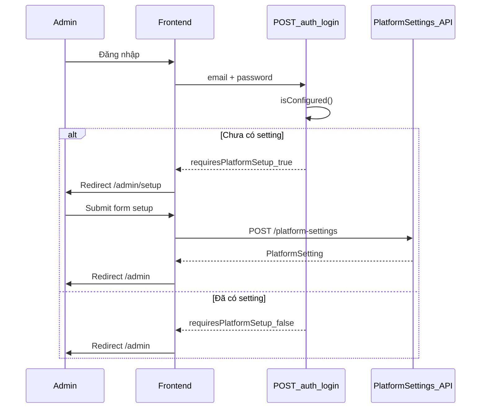

# Platform Settings Onboarding — Hướng dẫn cho Team

Tài liệu mô tả luồng **thiết lập platform setting lần đầu** khi admin đăng nhập. Backend đã implement phần kiểm tra và API; frontend cần đọc phần [Hướng dẫn Frontend](#6-hướng-dẫn-implement-frontend) để hoàn thiện UI.

---

## 1. Bối cảnh nghiệp vụ

Khi hệ thống khởi chạy lần đầu:

1. Backend tự tạo tài khoản admin mặc định (`admin@system.com` / `Admin@123`) — xem [DEFAULT_ADMIN_SEEDING.md](./DEFAULT_ADMIN_SEEDING.md).
2. Bảng `platform_settings` **chưa có dữ liệu**.
3. Admin đăng nhập lần đầu cần **thiết lập thông tin platform** (tên, email liên hệ, logo, banner, mô tả) trước khi dùng dashboard.

**Quan trọng:** Backend **không** tự gọi `createSetting` khi login. Login chỉ trả flag `requiresPlatformSetup`. Admin phải submit form → frontend gọi `POST /platform-settings`.

---

## 2. Luồng tổng quan

```text
App bootstrap
    │
    ▼
Tạo admin mặc định (nếu DB chưa có user)
    │
    ▼
Admin đăng nhập (POST /auth/login)
    │
    ├─ role ≠ admin → requiresPlatformSetup = false
    │
    └─ role = admin
            │
            ▼
        Kiểm tra platform_settings có record chưa?
            │
            ├─ Chưa có → requiresPlatformSetup = true
            │              │
            │              ▼
            │         Frontend redirect /admin/setup
            │              │
            │              ▼
            │         Admin điền form → POST /platform-settings
            │
            └─ Đã có → requiresPlatformSetup = false
                           │
                           ▼
                      Vào dashboard /admin bình thường
```



---

## 3. Thay đổi Backend đã implement

### 3.1. Login API — thêm field `requiresPlatformSetup`

**File:** `src/modules/auth/auth.service.ts`

Sau khi xác thực thành công, nếu user có role `admin`, backend gọi `PlatformSettingsService.isConfigured()`:

- Chưa có setting → `requiresPlatformSetup: true`
- Đã có setting → `requiresPlatformSetup: false`
- Role khác admin → luôn `requiresPlatformSetup: false`

**Response mẫu — admin chưa setup:**

```json
{
  "success": true,
  "message": "Login succesfully",
  "token": "eyJhbGciOiJIUzI1NiIs...",
  "user": {
    "userId": 1,
    "email": "admin@system.com",
    "fullName": "Admin",
    "roleId": 1,
    "roleName": "admin",
    "avatarUrl": null
  },
  "requiresPlatformSetup": true
}
```

**Response mẫu — admin đã setup hoặc user không phải admin:**

```json
{
  "success": true,
  "message": "Login succesfully",
  "token": "...",
  "user": { "roleName": "admin", "..." : "..." },
  "requiresPlatformSetup": false
}
```

### 3.2. Platform Settings Service

**File:** `src/modules/platform-settings/platform-settings.service.ts`

| Method | Mô tả |
|--------|--------|
| `isConfigured()` | Trả `true` nếu đã có ít nhất 1 record trong `platform_settings` |
| `createSetting(dto, files?)` | Tạo setting mới (upload logo/banner qua Cloudinary nếu có file) |
| `getSettings()` | Lấy setting hiện tại; **404** nếu chưa có (không auto-seed) |
| `updateSettings(dto)` | Cập nhật setting; **404** nếu chưa có |

**Lưu ý:** Đã **bỏ auto-seed** (`createDefaultSetting`) trong `getSettings` và `updateSettings`. Trước đây GET/PUT tự tạo default — giờ không còn, để admin phải setup thủ công qua POST.

### 3.3. Repository — check trùng khi tạo

**File:** `src/modules/platform-settings/platform-settings.repository.ts`

`createSetting()` tái sử dụng `getPlatformSetting()`:

- Nếu đã có setting → `409 Conflict` với message `Platform setting already exists`
- Hệ thống chỉ cho phép **một** platform setting duy nhất

---

## 4. API Reference (cho Frontend)

Tất cả endpoint dưới đây yêu cầu:

- Header: `Authorization: Bearer <token>`
- Role: `admin`

Base URL: theo `VITE_API_URL` (ví dụ `http://localhost:3000`).

### 4.1. Kiểm tra trạng thái setup

```
GET /platform-settings/status
```

**Response 200:**

```json
{ "configured": false }
```

hoặc

```json
{ "configured": true }
```

Dùng khi cần check lại sau login (ví dụ refresh trang, guard trên route admin).

---

### 4.2. Tạo platform setting (lần đầu)

```
POST /platform-settings
Content-Type: multipart/form-data
```

**Body (form fields):**

| Field | Bắt buộc | Kiểu | Mô tả |
|-------|----------|------|--------|
| `platformName` | Có | string | Tên hiển thị của platform |
| `platformEmail` | Có | email | Email liên hệ platform (unique trong DB) |
| `logoUrl` | Không | file | File ảnh logo (upload Cloudinary) |
| `bannerUrl` | Không | file | File ảnh banner (upload Cloudinary) |
| `description` | Không | string | Mô tả platform |

**Lưu ý multipart:** Field `logoUrl` và `bannerUrl` là **file upload**, không phải URL string khi gọi POST. Backend dùng `FileFieldsInterceptor` để nhận file.

**Response 200/201:** Object `PlatformSetting`

```json
{
  "settingId": 1,
  "platformName": "EdTech Learning Platform",
  "platformEmail": "support@edtech.example.com",
  "logoUrl": "https://res.cloudinary.com/.../logo.png",
  "bannerUrl": null,
  "description": "Nền tảng học trực tuyến",
  "createdAt": "2026-06-06T10:00:00.000Z"
}
```

**Lỗi thường gặp:**

| Status | Nguyên nhân |
|--------|-------------|
| 400 | Thiếu `platformName` / `platformEmail` hoặc email không hợp lệ |
| 401 | Chưa đăng nhập / token hết hạn |
| 403 | User không phải admin |
| 409 | Platform setting đã tồn tại (gọi POST lần 2) |

---

### 4.3. Lấy platform setting

```
GET /platform-settings
```

**Response 200:** Object `PlatformSetting` (như trên).

**Response 404:** Chưa có setting — `{ "statusCode": 404, "message": "Platform setting not found" }`

---

### 4.4. Cập nhật platform setting

```
PUT /platform-settings
Content-Type: application/json
```

**Body (tất cả optional):**

```json
{
  "platformName": "EdTech v2",
  "platformEmail": "contact@edtech.com",
  "logoUrl": "https://example.com/logo.png",
  "bannerUrl": "https://example.com/banner.png",
  "description": "Mô tả mới"
}
```

**Response 404** nếu chưa từng tạo setting qua POST.

---

## 5. Database schema

Bảng: `platform_settings`

| Column | Type | Ghi chú |
|--------|------|---------|
| `setting_id` | PK, auto increment | |
| `platform_name` | string, NOT NULL | |
| `platform_email` | string, NOT NULL, UNIQUE | |
| `logo_url` | string, nullable | |
| `banner_url` | string, nullable | |
| `description` | string, nullable | |
| `created_at` | timestamp | |

---

## 6. Hướng dẫn implement Frontend

Phần này dành cho frontend dev — các bước cụ thể cần làm.

### 6.1. Cập nhật type login response

**File đề xuất:** `frontend/src/services/auth/auth.service.ts`

```typescript
export interface LoginResponse {
  success: boolean;
  message: string;
  token: string;
  user: User;
  requiresPlatformSetup: boolean;
}
```

Cập nhật hàm `login()` để return đủ type trên (hiện `response.data` đã có field này từ backend).

### 6.2. Redirect sau login

**File:** `frontend/src/pages/auth/SignIn.tsx`

```typescript
const data = await login({ email: trimmedEmail, password: trimmedPassword });

if (user.roleName === 'admin' && data.requiresPlatformSetup) {
  navigate('/admin/setup');
} else if (user.roleName === 'admin') {
  navigate('/admin');
} else if (user.roleName === 'course provider') {
  navigate('/provider');
}
// ... các role khác
```

**Lưu ý:** `login` trong `auth.stores.ts` hiện chỉ return `user`. Cần sửa để return cả `requiresPlatformSetup` từ API response, hoặc lưu flag vào store.

**Gợi ý sửa store:**

```typescript
// auth.stores.ts
login: async (credentials) => {
  const data = await loginApi(credentials);
  const { token, user, requiresPlatformSetup } = data;
  set({ token, user, isAuthenticated: true, requiresPlatformSetup });
  return { user, requiresPlatformSetup };
},
```

### 6.3. Tạo service platform settings

**File đề xuất:** `frontend/src/services/platform-settings/platform-settings.service.ts`

```typescript
import api from '../../lib/axios';

export interface PlatformSetting {
  settingId: number;
  platformName: string;
  platformEmail: string;
  logoUrl: string | null;
  bannerUrl: string | null;
  description: string | null;
  createdAt: string;
}

export async function getPlatformSettingsStatus(): Promise<{ configured: boolean }> {
  const res = await api.get('/platform-settings/status');
  return res.data;
}

export async function getPlatformSettings(): Promise<PlatformSetting> {
  const res = await api.get('/platform-settings');
  return res.data;
}

export async function createPlatformSettings(formData: FormData): Promise<PlatformSetting> {
  const res = await api.post('/platform-settings', formData, {
    headers: { 'Content-Type': 'multipart/form-data' },
  });
  return res.data;
}

export async function updatePlatformSettings(data: Partial<PlatformSetting>): Promise<PlatformSetting> {
  const res = await api.put('/platform-settings', data);
  return res.data;
}
```

### 6.4. Tạo trang setup

**File đề xuất:** `frontend/src/pages/admin/PlatformSetup.tsx`

Form cần có:

- Input: `platformName` (required)
- Input: `platformEmail` (required, type email)
- File input: `logoUrl` (optional)
- File input: `bannerUrl` (optional)
- Textarea: `description` (optional)
- Nút Submit → gọi `createPlatformSettings(formData)`

Sau submit thành công → `navigate('/admin')`.

**Ví dụ build FormData:**

```typescript
const formData = new FormData();
formData.append('platformName', platformName);
formData.append('platformEmail', platformEmail);
if (description) formData.append('description', description);
if (logoFile) formData.append('logoUrl', logoFile);
if (bannerFile) formData.append('bannerUrl', bannerFile);

await createPlatformSettings(formData);
```

### 6.5. Thêm route

**File:** `frontend/src/routes/index.tsx`

```typescript
import { PlatformSetup } from '../pages/admin/PlatformSetup';

// Trong children của /admin
{
  path: 'setup',
  element: <PlatformSetup />,
},
```

Route đề xuất: `/admin/setup`

### 6.6. Guard — chặn admin chưa setup vào dashboard

Cập nhật `AdminGuard` hoặc layout admin để:

1. Nếu `requiresPlatformSetup === true` (hoặc gọi `GET /platform-settings/status` → `configured: false`)
2. Và route hiện tại **không phải** `/admin/setup`
3. → Redirect về `/admin/setup`

```typescript
// Pseudocode trong AdminGuard hoặc Admin layout
if (user.roleName === 'admin') {
  const { configured } = await getPlatformSettingsStatus();
  if (!configured && location.pathname !== '/admin/setup') {
    return <Navigate to="/admin/setup" replace />;
  }
}
```

Điều này đảm bảo admin không thể bỏ qua setup bằng cách gõ URL `/admin` trực tiếp.

---

## 7. Kịch bản test

### Backend (Swagger / Postman)

| # | Bước | Kỳ vọng |
|---|------|---------|
| 1 | Xóa data bảng `platform_settings` | Bảng trống |
| 2 | `POST /auth/login` với `admin@system.com` | `requiresPlatformSetup: true` |
| 3 | `GET /platform-settings/status` (Bearer token admin) | `{ "configured": false }` |
| 4 | `GET /platform-settings` | 404 |
| 5 | `POST /platform-settings` với `platformName` + `platformEmail` | 200, có record trong DB |
| 6 | Login lại admin | `requiresPlatformSetup: false` |
| 7 | `POST /platform-settings` lần 2 | 409 Conflict |
| 8 | Login user role `learner` | `requiresPlatformSetup: false` |

### Frontend (sau khi implement)

| # | Bước | Kỳ vọng |
|---|------|---------|
| 1 | Login admin lần đầu | Redirect `/admin/setup` |
| 2 | Submit form setup hợp lệ | Redirect `/admin`, không còn thấy trang setup |
| 3 | Login lại | Vào thẳng `/admin` |
| 4 | Gõ `/admin` khi chưa setup | Bị redirect về `/admin/setup` |

---

## 8. Files Backend liên quan

| File | Vai trò |
|------|---------|
| `src/modules/auth/auth.service.ts` | Login check + `requiresPlatformSetup` |
| `src/modules/auth/auth.module.ts` | Import `PlatformSettingsModule` |
| `src/modules/platform-settings/platform-settings.controller.ts` | REST endpoints |
| `src/modules/platform-settings/platform-settings.service.ts` | Business logic |
| `src/modules/platform-settings/platform-settings.repository.ts` | DB access |
| `src/modules/platform-settings/dto/create-platform-setting.dto.ts` | Validation POST body |
| `src/modules/platform-settings/entities/platform-setting.entity.ts` | Entity / schema |
| `src/modules/users/users.service.ts` | Seed admin mặc định khi bootstrap |

---

## 9. Câu hỏi thường gặp

**Q: Tại sao login không tự gọi `createSetting`?**

A: `createSetting` cần dữ liệu từ form (tên platform, email, logo...). Login chỉ có email/password nên không đủ thông tin. Backend chỉ trả flag; frontend hiển thị form và gọi POST.

**Q: Admin thứ 2 login thì sao?**

A: Nếu setting đã được tạo bởi admin trước, `requiresPlatformSetup` sẽ là `false`. Admin sau vào dashboard bình thường, không cần setup lại.

**Q: `GET /platform-settings` trả 404 có phải lỗi không?**

A: Không — đó là hành vi đúng khi chưa setup. Dùng `GET /platform-settings/status` hoặc `requiresPlatformSetup` từ login để biết cần setup hay không.

**Q: Có thể tạo nhiều platform setting không?**

A: Không. Hệ thống thiết kế **một** setting duy nhất. POST lần 2 sẽ trả 409.

---

## 10. Liên kết tài liệu liên quan

- [DEFAULT_ADMIN_SEEDING.md](./DEFAULT_ADMIN_SEEDING.md) — Tài khoản admin mặc định khi bootstrap
- [AUTH_TEAM_GUIDE.md](./AUTH_TEAM_GUIDE.md) — JWT, guard, cách gọi API có auth
