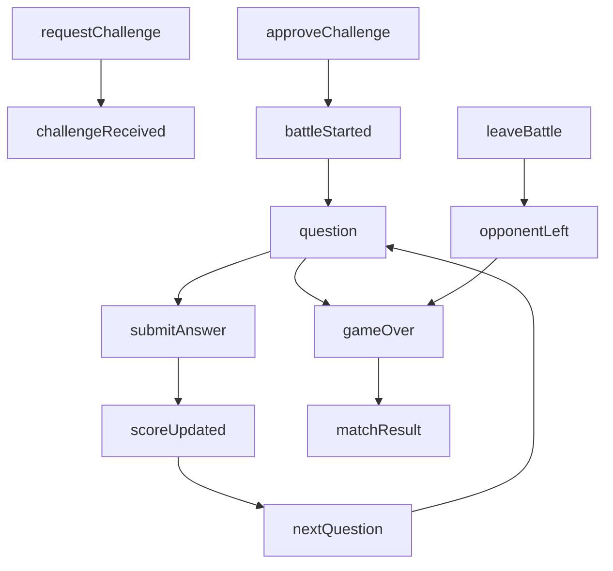

# PvP Battle WebSocket Integration Guide

## Mục đích

Tài liệu này mô tả **behavior đã được implement thực tế** ở backend PvP WebSocket để:

- teammate backend dễ hiểu flow hiện tại
- frontend có thể dựa vào để tích hợp socket
- giảm nhầm lẫn giữa spec ban đầu và code đã chạy

Tài liệu này tập trung vào:

- cách connect socket
- danh sách event client/server
- payload request/response
- thứ tự luồng battle
- các lỗi frontend cần handle

## Phạm vi hiện tại

Backend hiện đã implement:

- `requestChallenge`
- `approveChallenge` -> tự động tạo battle
- `submitAnswer`
- `leaveBattle`
- server emits:
  - `challengeReceived`
  - `challengeExpired`
  - `challengeCancelled`
  - `battleStarted`
  - `question`
  - `scoreUpdated`
  - `nextQuestion`
  - `gameOver`
  - `matchResult`
  - `opponentLeft`
  - `error`

Lưu ý:

- Battle được broadcast theo room `match_<matchId>`.
- Business logic nằm trong service, gateway chỉ nhận event và delegate.
- State của battle đang được giữ **in-memory** trong backend process.

## Socket connection

Backend dùng `Socket.IO`.

Frontend cần connect với token nằm trong `handshake.auth.token`.

Ví dụ:

```ts
import { io } from 'socket.io-client';

const socket = io('http://localhost:3000', {
  auth: {
    token: accessToken,
  },
});
```

Nếu token không hợp lệ hoặc không có token:

- server sẽ disconnect ngay khi connect

## Event names

### Client -> Server

```ts
requestChallenge
approveChallenge
rejectChallenge
cancelChallenge
submitAnswer
leaveBattle
```

### Server -> Client

```ts
challengeReceived
challengeExpired
challengeCancelled
battleStarted
question
scoreUpdated
nextQuestion
gameOver
matchResult
opponentLeft
error
```

## Battle config hiện tại

```ts
QUESTION_TIME = 15 // giây
CHALLENGE_TIMEOUT = 30000 // ms
MAX_PLAYER = 2
MAX_SCORE = 100
```

Frontend nên assume:

- mỗi câu hỏi có tối đa `15s`
- nếu hết thời gian, server sẽ tự chuyển câu tiếp theo hoặc kết thúc trận

## Room convention

Mỗi battle dùng một room riêng:

```ts
match_<matchId>
```

Ví dụ:

```ts
match_12
```

Frontend **không cần tự join room**.

Backend sẽ:

1. tạo match
2. tạo room
3. join 2 player vào room
4. emit battle events vào room đó

## High-level flow



## Challenge flow để vào battle

### 1. `requestChallenge`

Client gửi:

```ts
{
  assessmentId: number,
  receiverId: number
}
```

Validation chính:

- challenger phải là learner
- không được challenge chính mình
- opponent phải online
- không được có challenge pending trước đó
- assessment phải tồn tại
- assessment phải có type `PVP`
- cả 2 user phải hợp lệ theo logic enrollment hiện tại

Server emit:

### `challengeReceived`

Gửi tới người nhận challenge:

```ts
{
  challengeId: number,
  assessmentId: number,
  challengerId: number,
  receiverId: number,
  status: "PENDING",
  createdAt: string,
  respondedAt: string | null
}
```

### `challengeExpired`

Nếu sau `30s` challenge vẫn còn `PENDING`, server emit cho cả 2 user:

```ts
{
  challengeId: number,
  assessmentId: number,
  challengerId: number,
  receiverId: number,
  status: "PENDING" | "EXPIRED",
  createdAt: string,
  respondedAt: string | null
}
```

Ghi chú:

- payload đang dựa trên object challenge hiện có trong service/repository
- frontend nên dùng `challengeId` làm khóa chính

### 2. `approveChallenge`

Client gửi:

```ts
{
  challengeId: number
}
```

Điều kiện:

- chỉ `receiver` mới được approve
- challenge phải đang ở trạng thái `PENDING`

Sau khi approve thành công, backend sẽ **không emit `challengeApproved` riêng** ở phiên bản hiện tại.

Thay vào đó backend đi thẳng sang battle flow:

1. update challenge status
2. tạo `PvpMatch`
3. tạo room `match_<matchId>`
4. join 2 players vào room
5. load question list
6. emit `battleStarted`
7. emit `question` đầu tiên

## Battle flow

### `battleStarted`

Server emit vào room:

```ts
{
  matchId: number,
  assessmentId: number,
  roomId: string,
  totalQuestions: number
}
```

Frontend nên:

- chuyển UI sang battle screen
- lưu `matchId`
- reset local score/timer/state

### `question`

Server emit vào room:

```ts
{
  matchId: number,
  questionIndex: number, // bắt đầu từ 1
  question: {
    questionId: number,
    content: string,
    type: string,
    position: number,
    options: {
      optionId: number,
      content: string,
      position: number
    }[]
  }
}
```

Quan trọng:

- backend **không trả về đáp án đúng**
- backend **không trả về `isCorrect` cho frontend**
- frontend phải render timer dựa trên event này và `QUESTION_TIME = 15s`

### `submitAnswer`

Client gửi:

```ts
{
  matchId: number,
  questionId: number,
  optionId: number
}
```

Behavior:

1. backend validate match/session
2. validate player có thuộc match không
3. validate question hiện tại có đúng không
4. validate option có thuộc question hiện tại không
5. chặn submit trùng trong cùng 1 câu
6. nếu đúng thì cộng điểm theo `question.points`
7. update score trong DB
8. emit `scoreUpdated`
9. nếu cả 2 người đã trả lời thì emit `nextQuestion` rồi emit `question` tiếp theo

### `scoreUpdated`

Server emit vào room:

```ts
{
  matchId: number,
  player1Score: number,
  player2Score: number
}
```

Lưu ý cho frontend:

- payload này không gắn score với `userId`
- mapping hiện tại là:
  - `player1Score` = score của challenger
  - `player2Score` = score của receiver
- nếu UI cần biết ai là `player1`/`player2`, frontend nên lưu role từ battle start context hoặc challenge context

### `nextQuestion`

Server emit vào room:

```ts
{
  matchId: number,
  questionIndex: number
}
```

Ngay sau đó server sẽ emit tiếp event `question`.

Frontend nên:

- dùng `nextQuestion` như tín hiệu chuyển màn hình/trạng thái ngắn
- chuẩn bị render câu mới khi `question` tới

### Timeout behavior

Nếu một câu hỏi hết `15s`:

- backend sẽ tự kiểm tra battle session hiện tại
- nếu trận vẫn còn active, backend sẽ tự gọi flow chuyển câu
- không có event timeout riêng

Nghĩa là frontend sẽ chỉ thấy:

- `nextQuestion` + `question`, hoặc
- `gameOver`

## Kết thúc trận

### `gameOver`

Server emit vào room:

```ts
{
  matchId: number,
  winnerId: number | null,
  player1Score: number,
  player2Score: number
}
```

Ghi chú:

- `winnerId = null` nghĩa là hòa
- sau event này backend đã update `PvpMatch` sang trạng thái completed

### `matchResult`

Server emit vào room sau `gameOver`:

```ts
{
  matchId: number,
  winner: number | null,
  loser: number | null,
  totalQuestions: number,
  correctAnswers: {
    player1: number,
    player2: number
  },
  accuracy: {
    player1: number,
    player2: number
  },
  battleDuration: number
}
```

Ý nghĩa:

- `battleDuration`: số giây từ lúc battle bắt đầu tới lúc kết thúc
- `accuracy.player1` và `accuracy.player2` là số thập phân trong khoảng `0 -> 1`
  - ví dụ `0.75` = đúng 75%

Frontend có thể:

- hiển thị result modal/screen từ `gameOver`
- dùng `matchResult` để show thống kê chi tiết

## Người chơi thoát giữa trận

### `leaveBattle`

Client gửi:

```ts
{
  matchId: number
}
```

Behavior:

1. backend xác định player rời trận
2. opponent thắng ngay lập tức
3. emit `opponentLeft`
4. emit `gameOver`
5. emit `matchResult`
6. remove room/session in-memory

### `opponentLeft`

Server emit vào room:

```ts
{
  matchId: number,
  playerId: number
}
```

`playerId` là user vừa rời trận.

Frontend nên:

- hiển thị thông báo đối thủ đã thoát
- chờ `gameOver` để chốt result cuối cùng

## Error handling

Khi business validation fail, gateway sẽ emit event:

### `error`

Payload:

```ts
{
  code: string,
  message: string
}
```

Các mã lỗi hiện tại có thể gặp:

```ts
ASSESSMENT_NOT_FOUND
QUESTION_NOT_FOUND
MATCH_NOT_FOUND
MATCH_FINISHED
PLAYER_NOT_IN_MATCH
QUESTION_TIMEOUT
DUPLICATE_SUBMISSION
INVALID_OPTION
BAD_REQUEST
INTERNAL_ERROR
```

Ví dụ:

```ts
{
  code: "DUPLICATE_SUBMISSION",
  message: "You have already submitted an answer for this question."
}
```

Frontend nên:

- luôn listen event `error`
- hiển thị toast hoặc inline error
- với `MATCH_FINISHED` hoặc `MATCH_NOT_FOUND`, nên điều hướng ra khỏi battle screen

## Khuyến nghị cho frontend state

Frontend nên giữ local state tối thiểu:

```ts
type BattleClientState = {
  matchId: number | null;
  roomId: string | null;
  questionIndex: number;
  totalQuestions: number;
  currentQuestion: {
    questionId: number;
    content: string;
    type: string;
    options: {
      optionId: number;
      content: string;
      position: number;
    }[];
  } | null;
  player1Score: number;
  player2Score: number;
  submittedOptionId: number | null;
  status: 'idle' | 'waiting' | 'playing' | 'result';
};
```

## Recommended frontend listeners

Frontend nên đăng ký ít nhất các listener sau:

```ts
socket.on('challengeReceived', handleChallengeReceived);
socket.on('challengeExpired', handleChallengeExpired);
socket.on('challengeCancelled', handleChallengeCancelled);

socket.on('battleStarted', handleBattleStarted);
socket.on('question', handleQuestion);
socket.on('scoreUpdated', handleScoreUpdated);
socket.on('nextQuestion', handleNextQuestion);
socket.on('opponentLeft', handleOpponentLeft);
socket.on('gameOver', handleGameOver);
socket.on('matchResult', handleMatchResult);
socket.on('error', handleSocketError);
```

Khi unmount screen:

```ts
socket.off('battleStarted', handleBattleStarted);
socket.off('question', handleQuestion);
socket.off('scoreUpdated', handleScoreUpdated);
socket.off('nextQuestion', handleNextQuestion);
socket.off('opponentLeft', handleOpponentLeft);
socket.off('gameOver', handleGameOver);
socket.off('matchResult', handleMatchResult);
socket.off('error', handleSocketError);
```

## Một số lưu ý quan trọng

### 1. Battle session đang là in-memory

Điều này có nghĩa là:

- nếu backend process restart giữa trận, battle session hiện tại sẽ mất
- không phù hợp cho multi-instance nếu chưa có shared state

### 2. Không có event timeout riêng

Frontend không nên chờ một event kiểu `questionTimeout`.

Hãy coi `nextQuestion` hoặc `gameOver` là kết quả cuối cùng sau timeout.

### 3. `matchResult` dùng id user, không phải profile object

Hiện tại:

- `winner` là `userId | null`
- `loser` là `userId | null`

Nếu frontend cần tên/avatar thì phải map từ user data hiện có.

### 4. Challenge flow hiện tại chưa emit đủ tất cả event trong spec cũ

Hiện code đang dùng battle flow thực chiến là chính.

Một số event challenge có khai báo trong constants nhưng **chưa được emit ở implementation hiện tại**, ví dụ:

- `challengePending`
- `challengeApproved`
- `challengeRejected`

Frontend nên bám theo behavior thực tế đã implement ở backend hiện tại.

## Checklist tích hợp frontend

- connect socket với `auth.token`
- gửi `requestChallenge`
- khi nhận `challengeReceived`, hiển thị popup accept/reject
- gửi `approveChallenge`
- nhận `battleStarted`
- nhận `question`
- gửi `submitAnswer`
- nhận `scoreUpdated`
- nhận `nextQuestion`
- nhận `question` tiếp theo
- khi kết thúc trận, nhận `gameOver`
- dùng `matchResult` để render thống kê
- luôn handle event `error`

## Tóm tắt ngắn

Nếu frontend chỉ cần flow tối thiểu để chạy được:

1. Connect socket với token
2. Listen:
   - `battleStarted`
   - `question`
   - `scoreUpdated`
   - `nextQuestion`
   - `gameOver`
   - `matchResult`
   - `opponentLeft`
   - `error`
3. Gửi:
   - `approveChallenge`
   - `submitAnswer`
   - `leaveBattle`

Đây là bộ event đủ để hoàn thành một trận PvP realtime theo implementation hiện tại.
