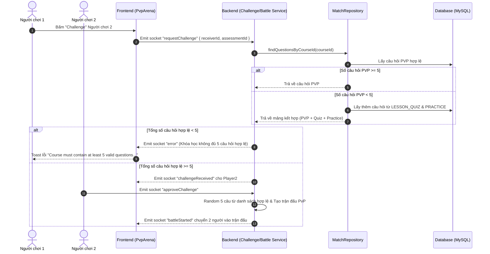

# Tài Liệu Kỹ Thuật: Cập Nhật Luồng Lấy Câu Hỏi & Ràng Buộc Thi Đấu PVP (PvP Question Selection Refactor)

Tài liệu này chi tiết hóa các thay đổi về logic nghiệp vụ, thuật toán lấy câu hỏi và điều kiện khởi tạo trận đấu PVP giữa Backend và Frontend nhằm giúp team dễ dàng nắm bắt và bảo trì.

---

## 1. Giới Thiệu & Lý Do Thay Đổi

- **Vấn đề cũ**:
  Trước đây, hệ thống yêu cầu một khóa học phải chứa 1 bài đánh giá PVP có ít nhất 5 câu hỏi dạng PVP thì trận đấu mới có thể diễn ra. Ràng buộc này thụ động, gây khó khăn cho giảng viên khi tạo nội dung và dễ dẫn đến lỗi không lấy được câu hỏi khi thách đấu.
- **Giải pháp mới**:
  1. **Ưu tiên câu hỏi PVP**: Khi thi đấu, hệ thống ưu tiên lấy các câu hỏi thuộc bài đánh giá `PVP` trong khóa học.
  2. **Tự động Fallback (Bổ sung)**: Nếu câu hỏi `PVP` chưa đủ 5 câu (hoặc bằng 0), hệ thống tự động lấy thêm câu hỏi từ các bài đánh giá dạng `LESSON_QUIZ` và `PRACTICE` trong khóa học đó.
  3. **Ràng buộc cứng 5 câu hỏi**: Trận đấu PVP hoặc lời thách đấu chỉ được phép khởi tạo khi khóa học có **tối thiểu 5 câu hỏi hợp lệ** (mỗi câu phải có từ 2 đáp án trở lên).

---

## 2. Thay Đổi Phía Backend

### 2.1. MatchRepository (`match.repository.ts`)
*Hàm*: `findQuestionsByCourseId(courseId: number)`

- **Thuật toán xử lý**:
  1. Truy vấn các câu hỏi thuộc bài đánh giá `PVP` của khóa học.
  2. Lọc danh sách `validPvpQuestions` (chỉ lấy các dạng trắc nghiệm `MULTIPLE_CHOICE_SINGLE`, `TRUE_FALSE`, `MULTIPLE_CHOICE_MULTI` và có $\ge 2$ options).
  3. Nếu `validPvpQuestions.length >= 5`: Trả về trực tiếp danh sách câu hỏi PVP này.
  4. Nếu `validPvpQuestions.length < 5`: Truy vấn tiếp các câu hỏi thuộc các bài đánh giá `LESSON_QUIZ` và `PRACTICE` trong khóa học (`validFallbackQuestions`).
  5. Trộn 2 danh sách (giữ câu hỏi PVP ở đầu, bổ sung câu hỏi Quiz/Practice đằng sau, loại bỏ trùng lặp `questionId`).

---

### 2.2. ChallengeRequestService (`challenge-request.service.ts`)
*Hàm*: `challengeRequests(...)`

- Thêm bước kiểm tra số lượng câu hỏi hợp lệ trước khi cho phép tạo thách đấu:
  ```typescript
  const questions = await this.matchRepository.findQuestionsByCourseId(assessment.courseId);
  const validQuestions = questions.filter((q) => q.options && q.options.length >= 2);

  if (validQuestions.length < 5) {
    throw new BadRequestException(
      'Course must contain at least 5 valid questions (with at least 2 options) to initiate a PVP challenge.',
    );
  }
  ```

---

### 2.3. BattleService (`battle.service.ts`)
*Hàm*: `createBattle(...)`

- Kiểm tra số lượng câu hỏi thực tế được cấp cho trận đấu:
  ```typescript
  if (validQuestions.length < 5) {
    throw new BadRequestException({
      code: 'QUESTION_NOT_FOUND',
      message: 'Course must contain at least 5 valid battle questions (with at least 2 options) to start a PvP match.',
    });
  }
  ```

---

### 2.4. AssessmentService (`assessment.service.ts`)
*Hàm*: `syncLessonAssessmentTree(...)`

- **Loại bỏ ràng buộc cứng**: Bỏ đoạn code `if (assessment.type === AssessmentType.PVP && assessment.questions.length < 5)` để giảng viên có thể lưu bài đánh giá PVP có ít hơn 5 câu hỏi mà không bị chặn lỗi validation.

---

## 3. Thay Đổi Phía Frontend

### 3.1. Giao Diện Quản Lý Bài Học (`LessonAssessmentSection.tsx`)
- Đổi nhãn cảnh báo đỏ `⚠️ Needs at least 5 questions` thành nhãn thông tin xanh linh hoạt:
  ```tsx
  {ast.type === 'PVP' && (
    <span className="text-[11px] text-[#2563EB] bg-[#EFF6FF] px-2 py-0.5 rounded font-semibold">
      💡 PvP prioritizes these questions ({ast.questions.length}); falls back to Quiz/Practice if < 5
    </span>
  )}
  ```

### 3.2. Xử Lý Socket Error (`PvpContext.tsx`)
- Lắng nghe sự kiện `error` từ server. Khi Backend ném lỗi thiếu câu hỏi ($<5$), client sẽ hiển thị thông báo toast chuẩn xác cho người dùng.

---

## 4. Sơ Đồ Luồng Xử Lý (Sequence Diagram)



---

## 5. Tóm Tắt Cho Developer (Developer Summary)

| Yếu tố | Logic Trước | Logic Mới |
| :--- | :--- | :--- |
| **Nguồn lấy câu hỏi** | Chỉ lấy duy nhất từ bài đánh giá PVP trong khóa học | Ưu tiên câu PVP, tự động bổ sung từ Quiz & Practice nếu chưa đủ |
| **Điều kiện khởi tạo** | Bắt buộc 1 bài PVP assessment phải có $\ge 5$ câu khi lưu | Tổng số câu hỏi hợp lệ trong toàn khóa học $\ge 5$ câu |
| **Trải nghiệm giảng viên** | Cứng nhắc, phải tạo đủ 5 câu PVP mới cho lưu | Linh hoạt, có thể tạo 1-2 câu PVP hoặc tận dụng câu hỏi Quiz sẵn có |
